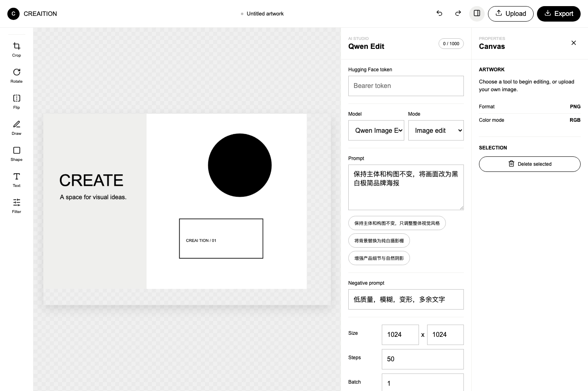

# Creaition AI Image Editor

基于 Angular 18、Angular Material、RxJS 和 `tui-image-editor@3.15.0` 二次改造的 Creaition 品牌图片编辑器。项目在 TUI/Fabric 画布能力之上实现了多图片白卡画布、AI 图像编辑、状态管理、本地持久化和 Vercel Serverless AI 网关。



## 在线演示

部署完成后填写实际地址：

```text
https://<your-project>.vercel.app
```

> 线上演示需要在 Vercel 项目环境变量中配置 `HF_TOKEN`，否则 AI 生成接口会返回缺少密钥的错误。

## 技术栈

- Angular 18
- Angular Material 18
- RxJS 7
- TUI Image Editor 3.15.0
- Fabric.js，来自 TUI Image Editor 内部依赖
- Hugging Face Inference SDK
- Qwen Image Edit
- IndexedDB、localStorage
- Vercel Serverless Functions

## 本地环境部署步骤

### 1. 环境要求

- Node.js 20 或更高版本
- npm
- 可访问 Hugging Face Inference Providers 的网络环境

### 2. 安装依赖

```bash
npm install
```

### 3. 启动开发环境

```bash
npm start
```

启动后会同时运行两部分：

- Angular 开发服务：`http://localhost:4200`
- 本地 AI 网关：`http://127.0.0.1:3001`

前端不会直接请求 Hugging Face，而是通过同源地址 `/api/ai/generate` 访问本地或 Vercel 网关。这样可以避免浏览器 CORS 问题，也方便在线上保护服务端 Token。

### 4. 本地代理设置

如果本机网络直连 Hugging Face 会超时，可以通过代理启动：

```bash
AI_PROXY=http://127.0.0.1:<HTTP代理端口> npm start
```

网关也会自动读取这些环境变量：

```text
HTTPS_PROXY
HTTP_PROXY
https_proxy
http_proxy
```

### 5. 构建检查

```bash
npm run build
```

当前构建中可能出现 `tui-color-picker` 和 `tui-image-editor` 上游 CSS 警告，例如旧 IE hack 写法和 `backbround-color` 拼写问题。这些警告来自第三方包发布文件，不影响应用运行。

## AI 接口密钥配置教程

本项目使用 Hugging Face 上的 Qwen Image Edit 模型：

```text
Qwen/Qwen-Image-Edit
Qwen/Qwen-Image-Edit-2509
Qwen/Qwen-Image-Edit-2511
```

### 申请 Hugging Face Token

1. 打开 [Hugging Face](https://huggingface.co/) 并注册或登录账号。
2. 进入 [Access Tokens](https://huggingface.co/settings/tokens)。
3. 点击创建新的 Token。
4. 推荐选择 Fine-grained Token。
5. 开启调用 Inference Providers 所需权限。
6. 创建后复制 Token，格式通常以 `hf_` 开头。

### 本地配置 Token

AI 密钥只在服务端配置，前端页面不提供 Token 输入框，也不会把密钥保存到浏览器。

本地运行前设置环境变量：

```bash
HF_TOKEN=hf_xxxxx npm start
```

如果使用 zsh，也可以先导出变量再启动：

```bash
export HF_TOKEN=hf_xxxxx
npm start
```

### Vercel 配置 Token

部署到 Vercel 后，推荐使用服务端环境变量：

1. 打开 Vercel 项目。
2. 进入 `Settings` -> `Environment Variables`。
3. 新增变量：

```text
Name: HF_TOKEN
Value: 你的 Hugging Face Token
```

4. 勾选 Production、Preview、Development。
5. 重新部署项目。
6. 重新部署后，服务端会自动读取 `HF_TOKEN`。
7. 可打开 `/api/ai/generate` 检查线上函数是否读到密钥。正常结果类似：

```json
{"hasServerToken":true,"tokenPrefix":"hf_"}
```

公开演示不建议无限开放个人 Token。正式产品应增加用户登录、服务端限流、真实配额记录和密钥轮换机制。

## 全部已实现功能清单

### 1. 编辑器分层组件

- `ImageEditorComponent`：编辑器根组件，负责整体布局、面板状态、AI 与画布联动。
- `ToolbarComponent`：品牌化工具栏，包含上传、裁剪、旋转、翻转、绘制、形状、文字、滤镜、撤销、重做、导出等操作入口。
- `EditorCanvasComponent`：封装 TUI Image Editor 和 Fabric 画布生命周期，负责画布缩放、平移、图片白卡、选择和删除。
- `PropertiesPanelComponent`：属性面板，管理选中对象和编辑属性。
- `AiPanelComponent`：AI 生成与编辑面板，管理模型、提示词、尺寸、模式、批量生成、结果、历史和收藏。

### 2. Creaition 品牌视觉适配

- 全局使用 `strokeWeight` 可变字体，配置 `wght` 和 `slnt` 字体变量。
- 字体回退为 `Eina03-Regular`。
- 颜色系统严格使用 Creaition 单色体系：黑、白、一级灰 `#efefee`、二级灰 `#bebebe`、页面背景 `#f0f0f0`。
- 按钮圆角统一为 `50px`，按钮最小高度为 `35px`。
- 输入框和表单控件圆角为 `0px`，高度为 `50px`。
- 卡片圆角为 `1rem`。
- 悬浮状态通过字体变量切换字重和倾斜角度。
- Angular Material 的 Slider、Tooltip、Snackbar、按钮和输入控件已做品牌化覆盖。
- TUI Image Editor 使用自定义主题适配 Creaition 变量和选择态样式。

### 3. 响应式布局

- 使用移动优先布局。
- 支持断点：`sm 640px`、`md 768px`、`lg 1024px`、`xl 1280px`。
- 移动端工具栏自动折叠到底部。
- 移动端属性面板切换为覆盖层。
- 右侧 AI 面板在小屏下以更适合触控的布局展示。
- 画布根据窗口、工具栏和面板状态自动重新计算尺寸。
- 关闭右侧面板后，画布会占满释放出来的空间。

### 4. 大画布与白卡编辑

- 图片不是单纯覆盖原图，而是以独立白色卡片加入同一工作区。
- 每张卡片可单独选择、移动、缩放、旋转和删除。
- 支持多张上传图和多张 AI 结果同时存在。
- AI 结果生成完成后会自动加入画布，并放在当前选中白卡旁边。
- 当前选中的白卡会自动作为 AI 图生图来源。
- 支持按钮缩放、滚轮缩放、移动端双指缩放。
- 支持 `Space + 拖动` 平移画布。
- 支持一键适应视口。

### 5. AI 服务层封装

- 新建独立 Angular 服务 `AiImageApiService`，统一处理 AI 请求。
- 使用 Angular 原生 `HttpClient` 发起请求。
- 浏览器只请求同源网关 `/api/ai/generate`。
- 本地由 `server/dev-api.mjs` 转发请求。
- 线上由 `api/ai/generate.mjs` 作为 Vercel Serverless Function 处理请求。
- `server/ai-request.mjs` 统一适配 Hugging Face Qwen Image Edit。
- 支持多模型参数统一格式。
- 支持网络错误、服务端错误、限流错误和模型加载错误提示。
- 对 429、5xx、网络超时等错误做指数退避重试。
- 支持月度 1000 次本地保护计数。
- 支持每分钟本地请求限流，避免误触连续消耗额度。

### 6. AI 数据状态管理

- 使用 RxJS `BehaviorSubject` 管理 AI 全局状态。
- 统一记录提示词、来源图、生成图集、历史记录、收藏、加载状态、错误信息、进度和模型配置。
- 每个模型的参数隔离存储，包括尺寸、步数、引导强度、变化强度和批量数。
- 用户偏好和模型配置持久化到 `localStorage`。
- AI Token 只保存在服务端环境变量，不进入浏览器存储。
- 图片历史和收藏持久化到 `localStorage`。
- 画布图片、位置、缩放和旋转持久化到 IndexedDB。

### 7. AI 编辑工作流

- 选中画布上的任意白卡，AI 面板自动使用该图片作为来源图。
- 输入提示词后调用 Qwen Image Edit 进行图生图编辑。
- 支持图片编辑、局部修图、风格迁移和画质增强模式。
- 支持提示词推荐和自动补全。
- 支持批量生成 1 到 4 张。
- 输出尺寸会自动跟随选中来源图的宽高比，减少 AI 结果被裁切或重新构图。
- 单张生成失败时，不影响其他成功结果展示。
- 生成成功后自动添加到画布，也可从历史或收藏中再次添加。

## 项目结构

```text
src/app/image-editor/
├── ai/
│   ├── ai-panel/
│   │   ├── ai-panel.component.html
│   │   ├── ai-panel.component.scss
│   │   └── ai-panel.component.ts
│   └── core/
│       ├── ai-image-api.service.ts
│       ├── ai-image-state.service.ts
│       ├── ai-image.types.ts
│       └── ai-storage.service.ts
├── core/
│   ├── artwork-storage.service.ts
│   ├── creaition.theme.ts
│   └── editor.types.ts
├── editor-canvas/
│   ├── editor-canvas.component.scss
│   └── editor-canvas.component.ts
├── properties-panel/
├── toolbar/
└── image-editor.component.*

server/
├── ai-request.mjs
└── dev-api.mjs

api/ai/
└── generate.mjs
```

### 目录说明

- `ai/core`：AI 请求、AI 全局状态、AI 本地存储和 TypeScript 类型。
- `ai/ai-panel`：AI 侧边面板 UI。
- `core`：编辑器主题、画布持久化和共享类型。
- `editor-canvas`：TUI/Fabric 画布封装。
- `toolbar`：品牌工具栏。
- `properties-panel`：属性面板。
- `server`：本地开发 AI 网关。
- `api`：Vercel Serverless AI 网关。

## 设计规范适配思路说明

### 品牌令牌集中管理

颜色、字体、圆角、尺寸和交互状态统一写在全局样式和主题适配文件中，避免组件各自写一套视觉规则。关键文件：

- `src/styles.scss`
- `src/app/image-editor/core/creaition.theme.ts`
- 各组件的 SCSS 文件

### TUI Image Editor 改造方式

TUI Image Editor 3.15.0 自带 UI 风格较重，不适合直接套品牌规范。因此项目没有使用 TUI 原生完整菜单，而是保留其底层编辑能力，并用 Angular 自建工具栏、面板和布局。

这种方式的好处是：

- 页面结构可以按照 Creaition 产品体验重新设计。
- 视觉规范可以统一落在 Angular 组件和 Material 覆盖样式上。
- TUI 只负责图像编辑能力，不控制整体产品外观。

### 字体变量交互

设计规范要求 `strokeWeight(var)` 支持字重和倾斜参数。项目通过 CSS `font-variation-settings` 控制：

```css
font-variation-settings: "wght" 60, "slnt" 0;
```

悬浮时切换到更高字重和倾斜角度：

```css
font-variation-settings: "wght" 80, "slnt" 12;
```

当前仓库不包含 `strokeWeight` 和 `Eina03-Regular` 的授权字体文件。应用会优先读取系统已安装字体并自动回退。正式提交品牌版本时，应在获得授权后加入 WOFF2 字体文件和 `@font-face` 资源声明。

### 响应式布局策略

布局从移动端开始设计，再逐步增强到桌面端：

- 小屏：工具栏折叠，属性面板覆盖显示，AI 面板保持触控可用。
- 中屏：增加画布可见区域，减少面板对工作区的挤压。
- 大屏：左侧工具栏、中央画布、右侧 AI 面板同时可见。
- 超大屏：保持画布优先，面板宽度受控，避免 UI 过宽导致操作距离过大。

## 开发过程遇到的难点与解决方案

### 1. TUI 3.15.0 与 Angular 18 的兼容

**问题：** TUI Image Editor 3.15.0 是较老的 UMD 生态依赖，和现代 Angular 构建方式不完全一致。

**解决：** 按依赖顺序加载 TUI 相关脚本，并在 Angular 组件中手动管理编辑器生命周期。TUI 的 CSS 构建警告保留为上游问题，不修改 `node_modules`。

### 2. 浏览器 CORS 与 Token 暴露

**问题：** 浏览器直接调用 Hugging Face 容易遇到 CORS，同时也会暴露长期 Token。

**解决：** 新增同源 AI 网关。开发环境使用本地 Node 网关，线上使用 Vercel Serverless Function。前端只调用 `/api/ai/generate`，Token 可放在服务端环境变量 `HF_TOKEN` 中。

### 3. AI 生成网络超时

**问题：** 本机网络直连 Hugging Face 推理供应商时可能出现连接超时。

**解决：** 网关支持 `AI_PROXY`、`HTTPS_PROXY`、`HTTP_PROXY` 等代理变量，并把网络错误转换成可读提示。前端会显示失败原因并支持重试。

### 4. 大画布与多图片工作区

**问题：** TUI 默认更偏向单张图片编辑，不是天然的无限画布产品。

**解决：** 让 Fabric 画布匹配可用视口，通过缩放和平移实现大画布体验。每张图片先合成到独立白卡，再作为对象加入画布，保留可移动、可缩放、可删除能力。

### 5. AI 结果自动加入画布

**问题：** 生成结果如果只显示在侧边栏，体验不符合“图片编辑器”的预期。

**解决：** 生成成功后自动把 AI 图片作为新白卡加入画布，并放在当前选中图片旁边。用户可以继续移动、缩放、再次作为来源图编辑。

### 6. 刷新后图片丢失

**问题：** 只用内存状态会导致刷新后画布内容消失。

**解决：** 增加 `ArtworkStorageService`，使用 IndexedDB 保存上传图和 AI 图的原始数据、位置、缩放、旋转等信息。刷新页面后自动恢复画布。

### 7. AI 输出裁切和比例变化

**问题：** 如果固定使用 1024 x 1024，横图来源容易被模型重新构图，看起来像左侧或边缘被裁掉。

**解决：** 选中来源图后自动同步输出尺寸比例，让 AI 输出尽量保持原图宽高比。同时在服务端提示词中加入保留完整画面、不要裁切、不要重新构图的约束。

### 8. 生成进度反馈

**问题：** Hugging Face 图片接口不是流式接口，通常完成后一次性返回图片，不能获得真实服务端百分比。

**解决：** 前端提供“预计阶段进度”，明确表现为生成中、排队、重试、成功、部分失败或失败，不伪装成真实服务端流式进度。

## 状态、存储与数据库说明

当前项目使用浏览器本地存储，不包含云端数据库。

| 数据类型 | 存储方式 | 说明 |
| --- | --- | --- |
| 画布图片、位置、缩放、旋转 | IndexedDB | 刷新后可恢复，同一浏览器有效 |
| AI 模型参数和用户偏好 | localStorage | 按模型隔离保存 |
| AI 历史和收藏 | localStorage | 最多保留近期记录 |
| Hugging Face Token | 服务端环境变量 `HF_TOKEN` | 前端不接收、不保存、不传递密钥 |
| 月度保护计数 | localStorage | 本地保护计数，不代表 Hugging Face 真实账单 |

如果要做成正式多用户产品，需要增加：

- 用户登录
- 云端对象存储，用于保存图片文件
- 服务端数据库，用于保存画布、任务、历史、收藏和真实配额
- 服务端鉴权和限流
- AI 任务队列

## 部署到 Vercel

项目已包含：

- `vercel.json`
- `api/ai/generate.mjs`
- `server/ai-request.mjs`

部署步骤：

1. 将完整源码推送到 GitHub。
2. 打开 Vercel，导入 GitHub 仓库。
3. Framework Preset 选择 Angular。
4. Build Command 使用：

```bash
npm run build
```

5. Output Directory 使用：

```text
dist/creaition-editor/browser
```

6. 在 Vercel 环境变量中配置 `HF_TOKEN`。
7. 重新部署。
8. 打开线上页面，上传图片，选中白卡，输入提示词，测试 AI 编辑。

## 评审重点对应关系

| 要求 | 当前实现 |
| --- | --- |
| 第三方开源组件深度改造 | 基于 TUI 3.15.0 重建品牌工具栏、面板和大画布体验 |
| Creaition 视觉规范 | 字体变量、单色配色、圆角、按钮、输入框和 Material 覆盖 |
| AI 第三方接口 | Hugging Face Qwen Image Edit，经同源网关调用 |
| Angular HttpClient | `AiImageApiService` 使用 HttpClient 请求 `/api/ai/generate` |
| 全局异常处理 | API 服务和状态服务统一转换错误并展示提示 |
| 加载态和进度 | AI 面板展示生成状态和预计阶段进度 |
| 限流和配额 | 浏览器侧每分钟限流和月度 1000 次保护计数 |
| 指数退避重试 | 网络错误、429、5xx 自动重试 |
| RxJS 状态管理 | `AiImageStateService` 使用 `BehaviorSubject` 管理全局状态 |
| 历史与收藏 | localStorage 持久化 |
| 多模型参数隔离 | 每个 Qwen 模型独立保存参数 |
| 图生图工作流 | 选中画布白卡后自动作为 AI 来源图 |
| AI 图片导入画布 | 生成成功后自动添加为新白卡 |
| 移动端适配 | 折叠工具栏、覆盖面板、双指缩放 |

## 已知边界

- 当前是本地 IndexedDB 持久化，不是跨设备云数据库。
- 局部修图使用自然语言指令，不是像素级蒙版编辑。
- 风格迁移和画质增强通过 Qwen Image Edit 指令实现，不是独立专用模型。
- 批量生成使用同一组参数并行生成，不是复杂参数矩阵。
- Hugging Face 图片接口没有真实流式进度，界面显示的是预计阶段进度。
- Qwen 生成模型可能改变文字细节或局部构图，项目已通过尺寸同步和提示词约束尽量减少裁切。
